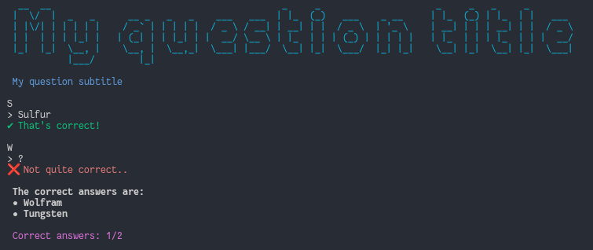

# AskMe-rs (askme-memorize)
Rewrite of [AskMe](https://github.com/DaringCuteSeal/askme) in Rust.

AskMe is a simple utility to help with memorizing terms, definitions, etc. AskMe files are written in [yaml](https://yaml.org/).

# Usage
`askme-rs <file>`




## Writing AskMe Files
Here's an example question file:

```yaml
# Questionnaire configuration
title: My question title              # Question title (string)
subtitle: My question subtitle        # Question subtitle (string)
wait_duration: 1.0                    # How long to wait before switching question (int/float)
shuffle: false                        # Shuffle questions? (boolean)
show_correct: true                    # Show correct answer(s)? (boolean)
loop_questions: false                 # Loop questions? (boolean)
case_sensitive: true                  # Use case-sensitive comparison? (boolean)

# List of questions
questions:
  - title: S                           # Question title (string)
    answers:                           # List of possible answers
      - Sulfur                         # Answer 1 (string)
      - Sulphur                        # Answer 2 (string)
  
  - title: W                           # Question title (string)
    answers:                           # List of possible answers
      - Wolfram                        # Answer 1 (string)
```


# Building & Installing
```sh
git clone 'https://github.com/DaringCuteSeal/askme-rs.git' askme-rs
make
```